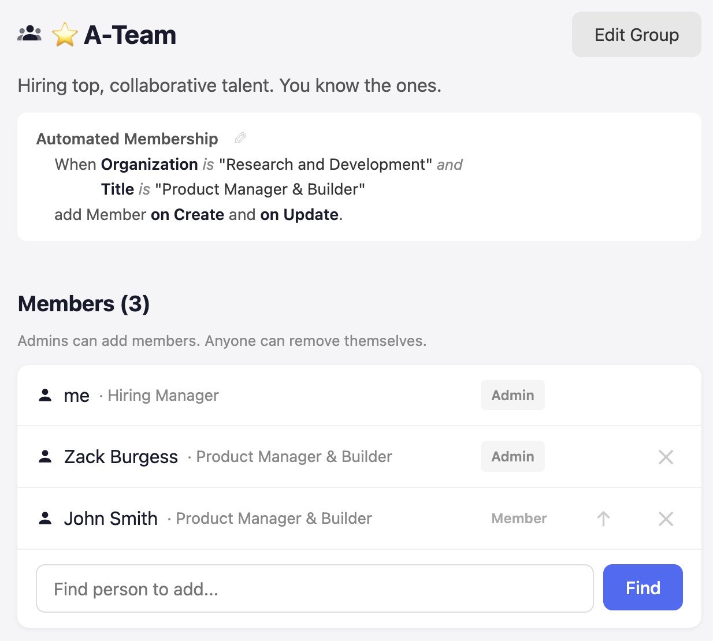

# Groups Manager with Automated Membership

A portfolio project showcasing Group Management for employees at a company. Groups give access to tools and news. With Automated Membership, new hires are automatically placed into the correct groups.

Shaped and vibe-coded by <a href="https://github.com/zack-burgess" target="_blank">Zack Burgess</a> and <a href="https://claude.ai" target="_blank">Claude</a>. To learn more about the discovery and delivery process, visit the <a href="https://zackburgess.co/case-study" target="_blank">case study</a>.

**<a href="https://zack-burgess.github.io/groups-manager/" target="_blank">Try the live demo</a>**


## Automated Membership

Every week, People Ops manually tracks new hires and adds them to the right groups. It's error-prone and doesn't scale. With Automated Membership, group admins define rules once — and new employees are placed into the correct groups automatically.

Set filters by Organization, Title, or Email with AND/OR logic:


Create a new employee:


They're automatically added to the group based on the rule:



## Demo

The <a href="https://zack-burgess.github.io/groups-manager/" target="_blank">live demo</a> is pre-seeded with employees, groups, and automation rules. Log in with any name to explore. Use **Reset Demo** from the gear menu to start fresh.

## Running Locally

1. Clone the repo and install dependencies:
   ```bash
   git clone https://github.com/zack-burgess/groups-manager.git
   cd groups-manager/client && npm install
   ```

2. Start the dev server:
   ```bash
   npm run dev
   ```

The app runs entirely in the browser using <a href="https://github.com/sql-js/sql.js" target="_blank">sql.js</a> (SQLite compiled to WebAssembly) — no backend required.

## Tech Stack

- **Frontend:** React + TypeScript (Vite)
- **Database:** SQLite via sql.js (client-side)
- **Routing:** React Router (HashRouter)
- **Styling:** Plain CSS

## Design

This project was shaped across two sessions with <a href="https://basecamp.com/shapeup/1.3-chapter-04" target="_blank">breadboarding and UI sketches</a> from Shape Up.

1. **Groups Manager** — [DESIGN.md](./DESIGN.md) — flows, places, affordances, and UI sketches
2. **Automated Membership** — <a href="./docs/automated_membership_product_pitch.pdf" target="_blank">Product Pitch (PDF)</a> — problem, outcome, shape, breadboard, UI sketches, and systems diagram
