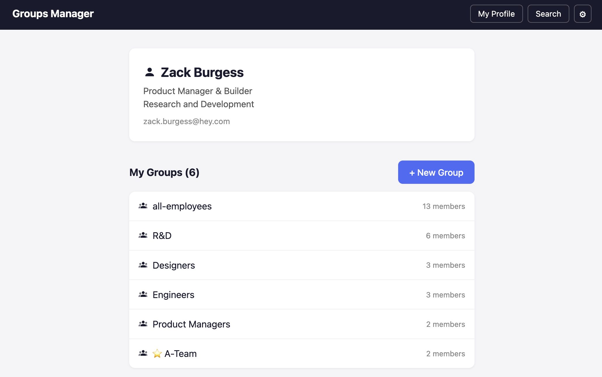
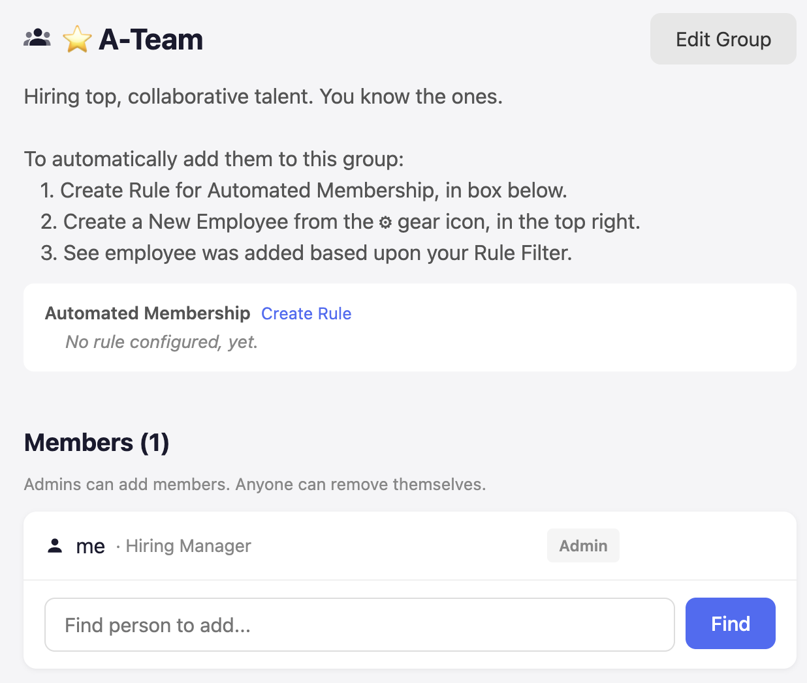
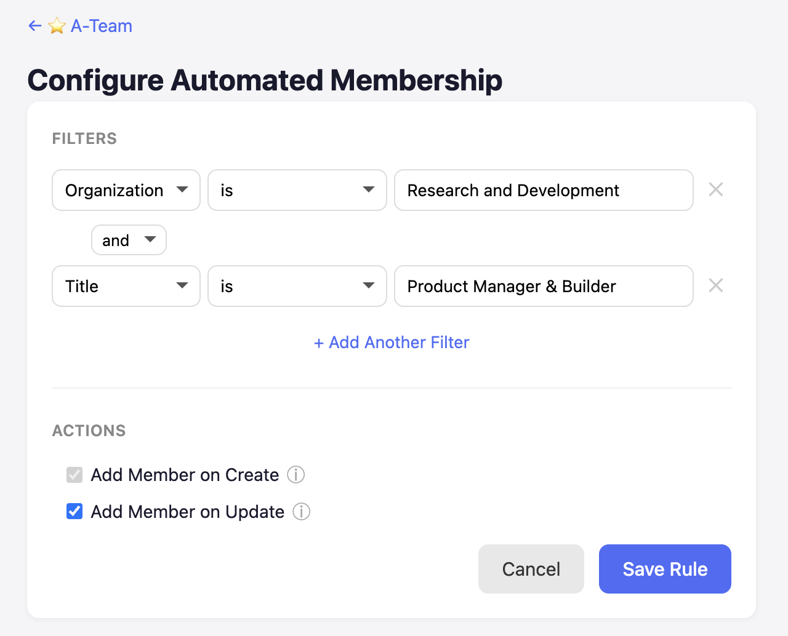
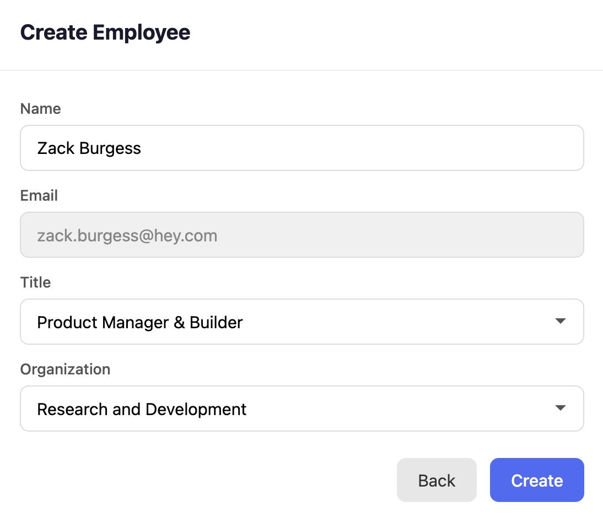

# Groups Manager with Automated Membership

A portfolio project showcasing Group Management for employees at a company. Groups give access to tools and news. With Automated Membership, new hires are automatically placed into the correct groups.

Shaped and vibe-coded by [Zack Burgess](https://github.com/zack-burgess) and [Claude](https://claude.ai). To learn more about the discovery and delivery process, visit the [case study](https://zackburgess.co/case-study).

**[Try the live demo](https://zack-burgess.github.io/groups-manager/)**



## Automated Membership

Groups support configurable rules that automatically add employees as members. As a group Admin, configure filters by Organization, Title, or Email — with AND/OR logic — and new employees matching the rule are added to the group on creation.





New employees are created from the gear icon in the top right. When a new employee matches a group's rule filters, they are automatically added as a member.



## Demo

The app is pre-seeded with 12 employees across multiple organizations (R&D, HR, Marketing, Sales, Finance, Operations) and 8 groups with automation rules already configured. Log in with any name to explore.

Use **Reset Demo** from the gear menu to revert all changes and start fresh.

## Running Locally

1. Clone the repo and install dependencies:
   ```bash
   git clone https://github.com/zack-burgess/groups-manager.git
   cd groups-manager/client && npm install
   ```

2. Start the dev server:
   ```bash
   npm run dev
   ```

The app runs entirely in the browser using [sql.js](https://github.com/sql-js/sql.js) (SQLite compiled to WebAssembly) — no backend required.

## Tech Stack

- **Frontend:** React + TypeScript (Vite)
- **Database:** SQLite via sql.js (client-side)
- **Routing:** React Router (HashRouter)
- **Styling:** Plain CSS

## Design

This project was shaped across two sessions with [breadboarding and UI sketches](https://basecamp.com/shapeup/1.3-chapter-04) from Shape Up.

1. **Groups Manager** — [DESIGN.md](./DESIGN.md) — flows, places, affordances, and UI sketches
2. **Automated Membership** — [Product Pitch (PDF)](./docs/automated_membership_product_pitch.pdf) — problem, outcome, shape, breadboard, UI sketches, and systems diagram
